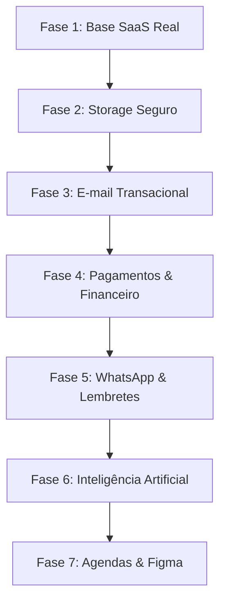

# KORA HUB - Integrations Roadmap & Migration Strategy

Este documento estabelece o roteiro técnico e estratégico para a transição do KORA HUB de um modelo baseado em armazenamento local (`localStorage`) e stubs operacionais para uma arquitetura integrada com APIs reais de mercado e base persistente no Supabase.

---

## 1. Visão Geral

Atualmente, o KORA HUB opera como um protótipo avançado (`SPA`), salvando a maior parte do estado operacional e comercial no navegador via `localStorage`. Algumas funcionalidades chaves possuem stubs interativos ou avisos de "Em breve" (como o checkout Asaas, disparos de WhatsApp e assistentes de Inteligência Artificial).

Para habilitar integrações reais, o sistema necessita de:
1. **Base de dados unificada e segura** (Supabase Postgres) com políticas de RLS (*Row Level Security*) para isolamento de dados por Workspace/Organização.
2. **Camada de backend segura** (Supabase Edge Functions ou servidor dedicado) para ocultar credenciais privadas de API.
3. **Migração segura e gradual** dos dados do `localStorage` para o banco remoto sem causar fricção ao usuário final.

---

## 2. Mapa de Stubs Encontrados

Após auditoria no codebase, mapeamos os seguintes stubs e marcações de integrações futuras:

| Módulo | Texto/Stub Encontrado | Arquivo / Linha | Integração Futura Relacionada | Risco | Prioridade |
| :--- | :--- | :--- | :--- | :---: | :---: |
| **Automações** | "Em breve" / "Integração futura" | `AISection.tsx:51` | Agente de IA para geração de briefing / propostas | Baixo | Média |
| **Integrações** | "Google Calendar / Google Drive / WhatsApp" | `IntegrationsSection.tsx:12` | Integração com agendas, repositório de arquivos e chats | Médio | Alta |
| **Configurações** | "Integração real será ativada..." | `Configuracoes.tsx:722` | Conexões de parceiros e ferramentas externas | Baixo | Média |
| **Financeiro** | "Asaas / Pix Automático" | `Financeiro.tsx:777` | Cobranças integradas com notificações automáticas | Alto | Alta |
| **CRM** | "Auto-lead WhatsApp" | `CRM.tsx:422` | Captura e criação automática de leads por chat | Médio | Média |
| **Portfólio** | "Figma API" / "Google Drive" | `ContentSection.tsx:749` | Anexos dinâmicos nos projetos | Baixo | Baixa |

---

## 3. APIs Candidatas

Identificamos e selecionamos as tecnologias mais recomendadas para as integrações do ecossistema:

### A. Banco / Auth / Storage
- **Supabase Auth**: Autenticação nativa com suporte a JWT, Magic Links e OAuth.
- **Supabase Database (PostgreSQL)**: Persistência relacional estável e robusta.
- **Supabase Storage**: Bucket seguro para armazenamento de assets e documentos.
- **Supabase Edge Functions**: Rotas de API serveless seguras para comunicação externa.

### B. E-mail Transacional
- **Resend**: Moderna, excelente entregabilidade e API developer-friendly.
- **Brevo (antigo Sendinblue)**: Excelente custo-benefício para alto volume de envios.

### C. Pagamentos e Cobrança (Brasil)
- **Asaas**: API especializada em cobrança, geração facilitada de Pix e boletos e split de pagamento.
- **Stripe**: Ideal para futuras transações internacionais e assinaturas SaaS recorrentes de forma global.

### D. WhatsApp
- **WhatsApp Cloud API (Oficial)**: Alta estabilidade, mas exige aprovação de templates comerciais.
- **Z-API / Evolution API (Não-oficiais)**: Úteis para prototipação rápida e envio livre de mensagens do sistema, com atenção redobrada ao risco de bloqueio de número.

### E. Inteligência Artificial
- **OpenAI API (GPT-4o/o1)**: Para processamento avançado de texto comercial.
- **Gemini API (Google)**: Custo altamente competitivo com maior janela de contexto para briefings volumosos.

### F. Calendário e Produtividade
- **Google Calendar API**: Sincronização em tempo real das datas de entrega e reuniões comerciais.

---

## 4. Ordem Recomendada (Roadmap de Integrações)



### Detalhamento das Fases

#### Fase 1 — Base SaaS real (Fundação)
- **O que fazer**: Integrar Supabase Auth, implementar estrutura de Workspaces multi-inquilino, tabelas básicas e políticas de RLS.
- **Justificativa**: Nenhuma integração de pagamento ou arquivo pode ser implementada de forma segura sem uma identidade digital confiável e controle de acesso aos dados.

#### Fase 2 — Storage seguro
- **O que fazer**: Configurar buckets no Supabase Storage com políticas de RLS.
- **Justificativa**: Permitirá o upload de logotipos, imagens de portfólio e anexos reais na Ficha Técnica de forma controlada.

#### Fase 3 — E-mail transacional
- **O que fazer**: Integração com Resend/Brevo para envio de orçamentos (links das propostas), confirmação de cadastros e alertas do sistema.
- **Justificativa**: Comunicação essencial para engajamento e ativação de clientes no portal.

#### Fase 4 — Financeiro/Pagamentos
- **O que fazer**: Integração com a API do Asaas/Stripe para emissão automatizada de PIX e boletos. Criação de endpoints (webhooks) para escuta de status da transação.
- **Justificativa**: Principal funcionalidade monetizável do KORA para os usuários finais.

#### Fase 5 — WhatsApp
- **O que fazer**: Conexão com API para notificações operacionais e lembretes de follow-up.
- **Justificativa**: Excelente canal de contato comercial no mercado brasileiro, devendo seguir políticas de opt-in claras para evitar bloqueio da conta.

#### Fase 6 — IA
- **O que fazer**: Integração com OpenAI/Gemini para enriquecer briefs, automatizar preenchimento de fichas técnicas e propor próximas melhores ações na Central do Dia.
- **Justificativa**: Aumenta o valor agregado e reduz o trabalho manual do usuário.

#### Fase 7 — Calendário / Drive / Figma
- **O que fazer**: Conectar APIs externas do usuário para espelhamento e controle de assets de design.
- **Justificativa**: Perfurações de produtividade periféricas que complementam a operação.

---

## 5. O que NÃO pode ficar no Frontend (Segurança)

Por segurança contra interceptações e engenharia reversa no cliente, os seguintes itens **devem ser mantidos exclusivamente no backend**:
- **API Keys Privadas**: Chaves de provedores como Asaas, Resend, OpenAI, Evolution API.
- **Tokens de Acesso de Terceiros**: Chaves de integração das contas dos usuários.
- **Service_role do Supabase**: Chave mestra de desvio de RLS.
- **Assinatura de Webhooks**: Validação criptográfica do payload recebido por webhook.
- **Geração de URLs de upload assinadas**: Controle centralizado de permissão antes do upload físico.

---

## 6. Necessidade de Edge Functions

As seguintes operações do KORA HUB serão processadas via **Supabase Edge Functions**:

1. `POST /api/payments/webhook`: Rota pública exposta para receber confirmações de pagamento das adquirentes (Asaas/Stripe) e atualizar o banco de dados interno.
2. `POST /api/email/send-quote`: Endpoint autenticado que recebe os dados do orçamento, gera a visualização e delega o envio de e-mail ao Resend de maneira segura.
3. `POST /api/ai/suggest`: Rota protegida que filtra o contexto de briefing ou dados operacionais antes de enviar para a OpenAI/Gemini, evitando vazamento de prompt ou exposição de credenciais.
4. `POST /api/whatsapp/notify`: Dispara notificações com tratamento de fila para evitar limites de concorrência.

---

## 7. Migração do LocalStorage

### Ordem Segura de Migração das Entidades (Dependência Lógica)

```
1. Workspaces (Tenant principal)
   └── 2. Clients (Clientes raiz)
         ├── 3. Contacts & Technical Sheet (Dependem de Client)
         ├── 4. Leads & Opportunities (Dependem de Client opcional)
         ├── 5. Quotes (Dependem de Client e/ou Lead)
         │     └── 6. Projects & Transactions (Dependem de Quotes/Clients)
         │             └── 7. Tasks (Dependem de Projects/Clients)
```

### Mecanismo de Sincronização / Híbrido
- Ao logar no Supabase pela primeira vez, o cliente detectará se há chaves `orbyt.*` ou `kora.*` no `localStorage`.
- Um assistente em segundo plano fará o upload em batch dos registros locais para a conta remota.
- Após o sucesso, os dados do `localStorage` serão limpos e o app mudará o estado de leitura para apontar diretamente para a API do Supabase.

---

## 8. Primeiro MVP de Integração Recomendado

> [!TIP]
> **Recomendação: Opção A - Supabase Auth + Database + Workspaces**

### Justificativa Técnica:
A fundação do KORA HUB é a organização dos workspaces operacionais e comerciais. Implementar o upload de arquivos (Opção B) antes de termos a estrutura de banco de dados e autenticação de usuários é um risco de segurança, pois não haveria um controle refinado sobre quem pode acessar cada arquivo no storage (RLS). 

Com a **Opção A** implementada, criamos uma barreira de autenticação sólida, ativamos o isolamento real por workspaces e garantimos que os dados comerciais futuros do usuário estejam devidamente protegidos de ponta a ponta.

---

## 9. Riscos a Monitorar

- **Vazamento de Dados Locais**: Falha no script de migração deletar os dados do usuário local antes de garantir a persistência remota.
- **Políticas de RLS Inadequadas**: Workspaces diferentes conseguirem ver dados uns dos outros devido a falha na modelagem de segurança na tabela Postgres.
- **Exposição de Chaves de API**: Desenvolvedor commitar arquivos `.env` ou expor chaves públicas no bundle de frontend do React.
- **Custo Inesperado com APIs**: Ausência de throttling ou limitadores de requests nos endpoints de IA e envio de e-mails, possibilitando abusos por requisições repetidas.

---

## 10. Plano para a Próxima Implementação

A primeira etapa do desenvolvimento técnico deve focar em:

> [!NOTE]
> **"Implementar fundação Supabase com workspaces e migração gradual de Clientes."**

Este passo inicial trará a base do banco de dados relacional e a autenticação, permitindo que a transição do `localStorage` seja feita de forma limpa e progressiva.
